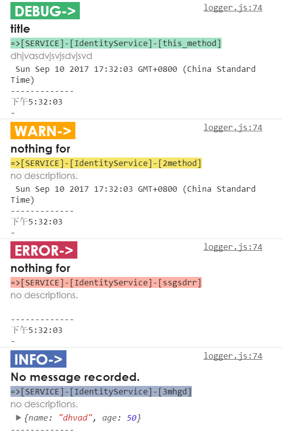
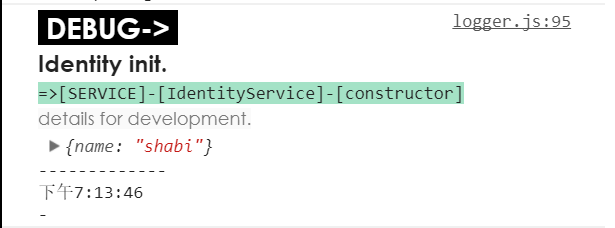

# ws-logger-generic : Logger  for ES5 javascript and typescript
 [](https://travis-ci.org/ws-types/ws-logger-generic)

the logger instance of logger-service for all es5 javascript and typescript

This is a library to make logger more powerful. 
There are 4 level and each level' consola-print has its colors and styles, also support to custom them.

## Add the package into your project
```npm
npm install ws-logger-generic --save
```
This package also need my regex package "ws-regex", it will be add in automatically, but try to add it if any mistake.
```npm
npm install ws-regex --save
```
If you want use logger as a service in angular4+, you can install another npm package which includes this logger feature:
```npm
npm install ws-logger --s
```

 ## Use in logger instance
 You can get more powerful logger features by call constructor:
 ```typescript
    const logger = new Logger({Level:0,IsProduction:false,styles:[]});
    logger.Debug('message','descriptions');
 ```

You can show the file position in color grid.

## More styles and levels
 ```typescript
        this.logger.Debug(['title', 'dhjvasdvjsvjsdvjsvd', new Date()], 'this_method');
        this.logger.Warn(['nothing for', new Date()], '2method');
        this.logger.Error('nothing for', 'ssgsdrr');
        this.logger.Info({ name: 'dhvad', age: 50 }, '3mhgd');
 ```


I will provide methods for custom-styles and more features later.

## Custom styles now is avalible
You should use logger instance to custom your log styles, you can set some level-styles in constructor so that the whole component socpe can use them.(if in angular4 or more frameworks.)
```typescript
/*change target level style.*/
this.logger.SetLogStyle(LogType.Debug, {
  icon: `background-color:black;font-size:1.6em;color:white;font-family:'Century Gothic','YaHei';font-weight:900`,
  msg: `font-size:1.3em;font-weight:700;font-family:'Century Gothic','YaHei';line-height:1.6;`,
  route: 'background-color:#a4e2c6;line-height:1.2;',
  descrb: `color:#787878;font-family:'Century Gothic';line-height:1.7;background-color:#fafafa;`,
  stamp: `font-size:0.6em;font-family:'Century Gothic';line-height:1.5;`
}).Debug(...);

/** you alse can changes all styles for logger.
  * [Debug, Info, Warn, Error]
  */
this.logger.SetLogStyle([
    {
        icon: `background-color:#3eb370;font-size:1.6em;color:white;font-family:'Century Gothic','YaHei';font-weight:900`,
        msg: `font-size:1.3em;font-weight:700;font-family:'Century Gothic','YaHei';line-height:1.6;`,
        route: 'background-color:#a4e2c6;line-height:1.2;',
        descrb: `color:#787878;font-family:'Century Gothic';line-height:1.7;background-color:#fafafa;`,
        stamp: `font-size:0.6em;font-family:'Century Gothic';line-height:1.5;`
    },
    {
        icon: `background-color:#4c6cb3;font-size:1.6em;color:white;font-family:'Century Gothic','YaHei';font-weight:900`,
        msg: `font-size:1.3em;font-weight:700;font-family:'Century Gothic','YaHei';line-height:1.6;`,
        route: 'background-color:#a1afc9;line-height:1.2;',
        descrb: `color:#787878;font-family:'Century Gothic';line-height:1.7;background-color:#fafafa;`,
        stamp: `font-size:0.6em;font-family:'Century Gothic';line-height:1.5;`
    }, {
        icon: `background-color:#ffa500;font-size:1.6em;color:white;font-family:'Century Gothic','YaHei';font-weight:900`,
        msg: `font-size:1.3em;font-weight:700;font-family:'Century Gothic','YaHei';line-height:1.6;`,
        route: 'background-color:#f5e56b;line-height:1.2;',
        descrb: `color:#787878;font-family:'Century Gothic';line-height:1.7;background-color:#fafafa;`,
        stamp: `font-size:0.6em;font-family:'Century Gothic';line-height:1.5;`
    },
    {
        icon: `background-color:#c93756;font-size:1.6em;color:white;font-family:'Century Gothic','YaHei';font-weight:900`,
        msg: `font-size:1.3em;font-weight:700;font-family:'Century Gothic','YaHei';line-height:1.6;`,
        route: 'background-color:#ffb3a7;line-height:1.2;',
        descrb: `color:#787878;font-family:'Century Gothic';line-height:1.7;background-color:#fafafa;`,
        stamp: `font-size:0.6em;font-family:'Century Gothic';line-height:1.5;`
    }
]);

/*anyway ,you can use property instead.*/
this.logger.LogStyles = [
   {
        icon: `background-color:#3eb370;font-size:1.6em;color:white;font-family:'Century Gothic','YaHei';font-weight:900`,
        msg: `font-size:1.3em;font-weight:700;font-family:'Century Gothic','YaHei';line-height:1.6;`,
        route: 'background-color:#a4e2c6;line-height:1.2;',
        descrb: `color:#787878;font-family:'Century Gothic';line-height:1.7;background-color:#fafafa;`,
        stamp: `font-size:0.6em;font-family:'Century Gothic';line-height:1.5;`
    },
    {
        icon: `background-color:#4c6cb3;font-size:1.6em;color:white;font-family:'Century Gothic','YaHei';font-weight:900`,
        msg: `font-size:1.3em;font-weight:700;font-family:'Century Gothic','YaHei';line-height:1.6;`,
        route: 'background-color:#a1afc9;line-height:1.2;',
        descrb: `color:#787878;font-family:'Century Gothic';line-height:1.7;background-color:#fafafa;`,
        stamp: `font-size:0.6em;font-family:'Century Gothic';line-height:1.5;`
    }, {
        icon: `background-color:#ffa500;font-size:1.6em;color:white;font-family:'Century Gothic','YaHei';font-weight:900`,
        msg: `font-size:1.3em;font-weight:700;font-family:'Century Gothic','YaHei';line-height:1.6;`,
        route: 'background-color:#f5e56b;line-height:1.2;',
        descrb: `color:#787878;font-family:'Century Gothic';line-height:1.7;background-color:#fafafa;`,
        stamp: `font-size:0.6em;font-family:'Century Gothic';line-height:1.5;`
    },
    {
        icon: `background-color:#c93756;font-size:1.6em;color:white;font-family:'Century Gothic','YaHei';font-weight:900`,
        msg: `font-size:1.3em;font-weight:700;font-family:'Century Gothic','YaHei';line-height:1.6;`,
        route: 'background-color:#ffb3a7;line-height:1.2;',
        descrb: `color:#787878;font-family:'Century Gothic';line-height:1.7;background-color:#fafafa;`,
        stamp: `font-size:0.6em;font-family:'Century Gothic';line-height:1.5;`
    }
];
```


You can changes styles in the provider, so that all scope will use your custom-settings.(if you use the logger service in angular4 as a service in app.module.ts)

```typescript
@NgModule({
  declarations: [
    // ...
  ],
  imports: [
    // ...
  ],
  providers: [
    { provide: LOGGER_SERVICE_CONFIG, useValue: { Level: level, IsProduction: isProd, styles:[
        {
            icon: `background-color:#3eb370;font-size:1.6em;color:white;font-family:'Century Gothic','YaHei';font-weight:900`,
            msg: `font-size:1.3em;font-weight:700;font-family:'Century Gothic','YaHei';line-height:1.6;`,
            route: 'background-color:#a4e2c6;line-height:1.2;',
            descrb: `color:#787878;font-family:'Century Gothic';line-height:1.7;background-color:#fafafa;`,
            stamp: `font-size:0.6em;font-family:'Century Gothic';line-height:1.5;`
        },
        {
            icon: `background-color:#4c6cb3;font-size:1.6em;color:white;font-family:'Century Gothic','YaHei';font-weight:900`,
            msg: `font-size:1.3em;font-weight:700;font-family:'Century Gothic','YaHei';line-height:1.6;`,
            route: 'background-color:#a1afc9;line-height:1.2;',
            descrb: `color:#787878;font-family:'Century Gothic';line-height:1.7;background-color:#fafafa;`,
            stamp: `font-size:0.6em;font-family:'Century Gothic';line-height:1.5;`
        }, {
            icon: `background-color:#ffa500;font-size:1.6em;color:white;font-family:'Century Gothic','YaHei';font-weight:900`,
            msg: `font-size:1.3em;font-weight:700;font-family:'Century Gothic','YaHei';line-height:1.6;`,
            route: 'background-color:#f5e56b;line-height:1.2;',
            descrb: `color:#787878;font-family:'Century Gothic';line-height:1.7;background-color:#fafafa;`,
            stamp: `font-size:0.6em;font-family:'Century Gothic';line-height:1.5;`
        },
        {
            icon: `background-color:#c93756;font-size:1.6em;color:white;font-family:'Century Gothic','YaHei';font-weight:900`,
            msg: `font-size:1.3em;font-weight:700;font-family:'Century Gothic','YaHei';line-height:1.6;`,
            route: 'background-color:#ffb3a7;line-height:1.2;',
            descrb: `color:#787878;font-family:'Century Gothic';line-height:1.7;background-color:#fafafa;`,
            stamp: `font-size:0.6em;font-family:'Century Gothic';line-height:1.5;`
        }
    ] }
     },
    LoggerService
  ],
  bootstrap: [RootComponent]
})
export class AppModule { }
```